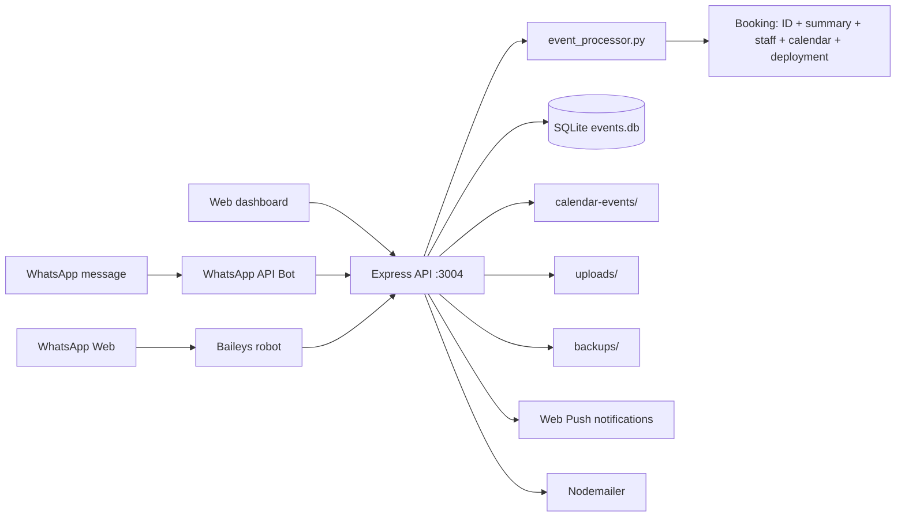

# Fresh People Event Operations

Automated event-booking and operations system for **Fresh People** — parse a WhatsApp-style booking message and get a confirmed booking, an allocated staff team, a Google-Calendar-ready event, and a deployment message in one flow.

[](package.json)
[](event_processor.py)
[](LICENSE)
[](https://github.com/YassinAliYassin/fresh-people-event-ops/actions/workflows/build.yml)
[](https://github.com/YassinAliYassin/fresh-people-event-ops/actions/workflows/secret-scan.yml)

## Overview

Fresh People Event Operations turns a plain-text booking message into a complete operational package:

```
EVENT: Corporate Gala
CLIENT: John Doe
DATE: 2026-06-15
TIME: 18:00
LOCATION: Johannesburg Convention Centre
GUESTS: 200
STAFF_REQUIRED: 5
SERVICES: Waiters, Baristas
NOTES: VIP Section needed
```

...and returns **A.** an event ID, **B.** a confirmed booking summary, **C.** an assigned staff list with a team leader, **D.** a Google-Calendar-compatible `.ics` event, and **E.** a WhatsApp deployment message.

## Features

- **Booking parsing** — extracts EVENT / CLIENT / DATE / TIME / LOCATION / GUESTS / STAFF_REQUIRED / SERVICES / NOTES cleanly.
- **Automatic staff allocation** — randomizes the default staff pool and promotes a team leader.
- **Calendar generation** — emits RFC-5545 (`VCALENDAR`) text that pastes straight into Google Calendar.
- **Deployment messages** — WhatsApp-ready text with arrival time (1h before start) and dress code.
- **REST API** — `POST /process-booking` for programmatic use.
- **Web dashboard** — full CRUD UI for events, staff and expenses with auth, PDF export and file uploads.
- **WhatsApp integration** — WhatsApp Business API bot + a Baileys (WhatsApp Web) robot.
- **Validation** — all required fields checked with clear error messages.

## Tech Stack

| Layer | Technology |
|-------|------------|
| API / Bot (Node) | Express, Baileys, node-telegram-bot-api |
| Processor (Python) | Python 3 (standard library only) |
| Dashboard (Node) | Express, SQLite3, PDFKit, multer, bcryptjs, web-push, nodemailer |
| Data | SQLite (`events.db`) |
| Ops | PM2 (`ecosystem.config.js`), shell scripts |
| CI | GitHub Actions (build/health + secret scan) |

## Architecture



Three services (bot, API, dashboard) run under PM2 — see `ecosystem.config.js` and `start-all.sh`.

## Installation

### Prerequisites

- **Node.js 20+** and npm
- **Python 3.8+**
- (Optional) PM2 for process management: `npm install -g pm2`

### Install

```bash
git clone https://github.com/YassinAliYassin/fresh-people-event-ops.git
cd fresh-people-event-ops
npm install          # root: bot + API
npm --prefix web-dashboard install   # dashboard
```

## Local Development

Three services run on separate ports (configurable via env):

```bash
npm run api         # Express API on :3010
npm run bot         # WhatsApp API bot on :3011
npm run dashboard   # Web dashboard on :3004
```

Or launch everything with PM2:

```bash
npm install -g pm2
pm2 start ecosystem.config.js
pm2 status
```

**Quick smoke test of the core booking flow:**

```bash
npm test            # runs all integration tests on fresh SQLite DBs
```

## Deployment

- **Process manager:** PM2 (`ecosystem.config.js`) with `Restart=always` behaviour via `start-event-ops.sh` / `start-all.sh`.
- **CI:** `.github/workflows/build.yml` installs, syntax-checks, boots each service and runs the integration tests on every push/PR.
- **Secrets:** `.github/workflows/secret-scan.yml` blocks any push/PR that introduces a real credential.

## Environment Variables

Copy `.env.example` to `.env` and fill in the values:

| Variable | Used by | Purpose |
|----------|---------|---------|
| `PORT` | API | API listen port (default 3010) |
| `EVENTS_DB` | Dashboard | Path to SQLite DB |
| `WA_ACCESS_TOKEN` | Bot | WhatsApp Business API token |
| `WA_PHONE_NUMBER_ID` | Bot | WhatsApp Business phone number ID |
| `TELEGRAM_BOT_TOKEN` | Bot | Telegram bot token (optional) |
| `VAPID_PUBLIC_KEY` / `VAPID_PRIVATE_KEY` | Dashboard | Web Push keys |
| `SMTP_HOST` / `SMTP_USER` / `SMTP_PASS` | Dashboard | Nodemailer credentials |

> Never commit real tokens. Load them from the environment or a local `.env` (gitignored).

## Folder Structure

```
fresh-people-event-ops/
├── event_processor.py      # Core booking parser + generator (Python)
├── server.js               # Express API (POST /process-booking, homepage, health)
├── whatsapp-api-bot.js     # WhatsApp Business API bot
├── query.py / schema.py / upcoming.py / cf_check.py  # Python support tools
├── *.sh                    # Ops / workflow shell scripts
├── ecosystem.config.js     # PM2 process definitions
├── web-dashboard/          # Web dashboard (frontend + server-v4.js)
│   ├── server-v4.js        # Dashboard Express server (auth, CRUD, PDF, uploads)
│   ├── quick-book.html     # Quick booking UI
│   └── public/             # Static assets
├── test/                   # Integration tests (Node)
└── .github/workflows/      # CI (build.yml, secret-scan.yml)
```

## Roadmap

- [ ] Add automated unit tests for the Python processor.
- [ ] Split the 8.5k-line `server-v4.js` into modular routers/controllers.
- [ ] Add API versioning and OpenAPI/Swagger docs.
- [ ] Move staff pool into the DB (configurable per event) instead of a hardcoded list.
- [ ] Add rate limiting and request-size limits to all public endpoints.
- [ ] Containerize with Docker / docker-compose.

## Contributing

Please read [CONTRIBUTING.md](CONTRIBUTING.md) and our [Code of Conduct](CODE_OF_CONDUCT.md). Report security issues privately via [SECURITY.md](SECURITY.md).

## License

[MIT](LICENSE) © Yassin Ali
